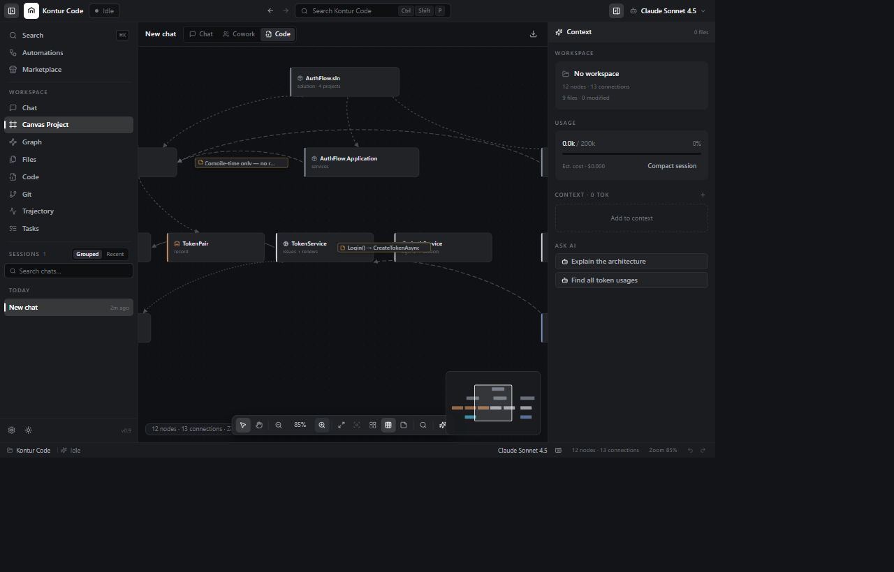
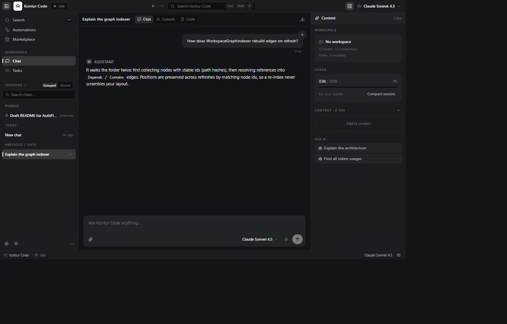
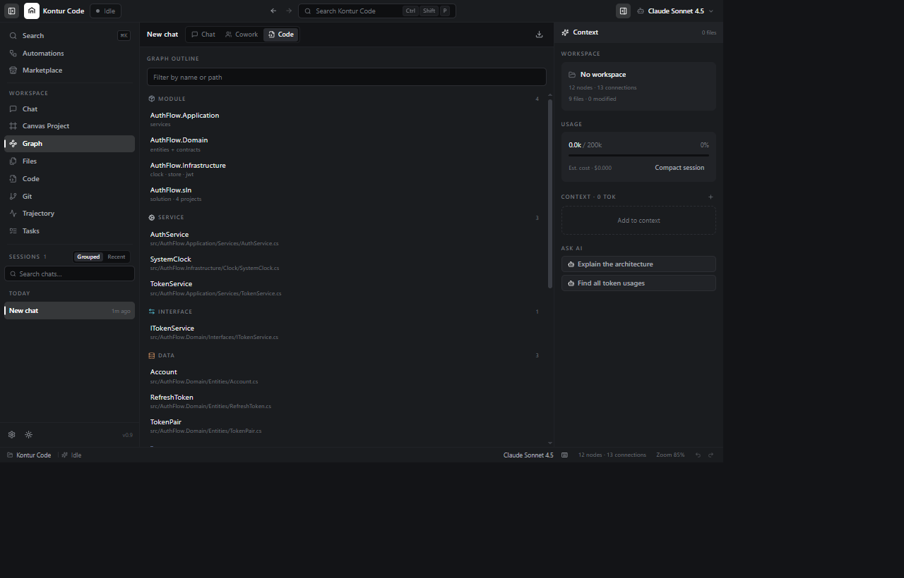
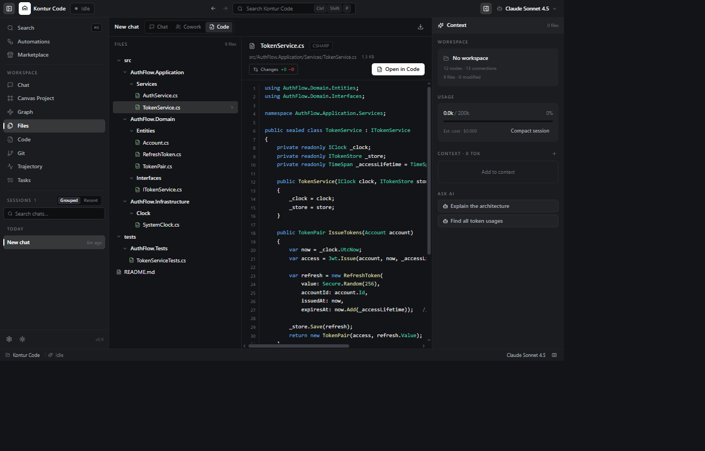
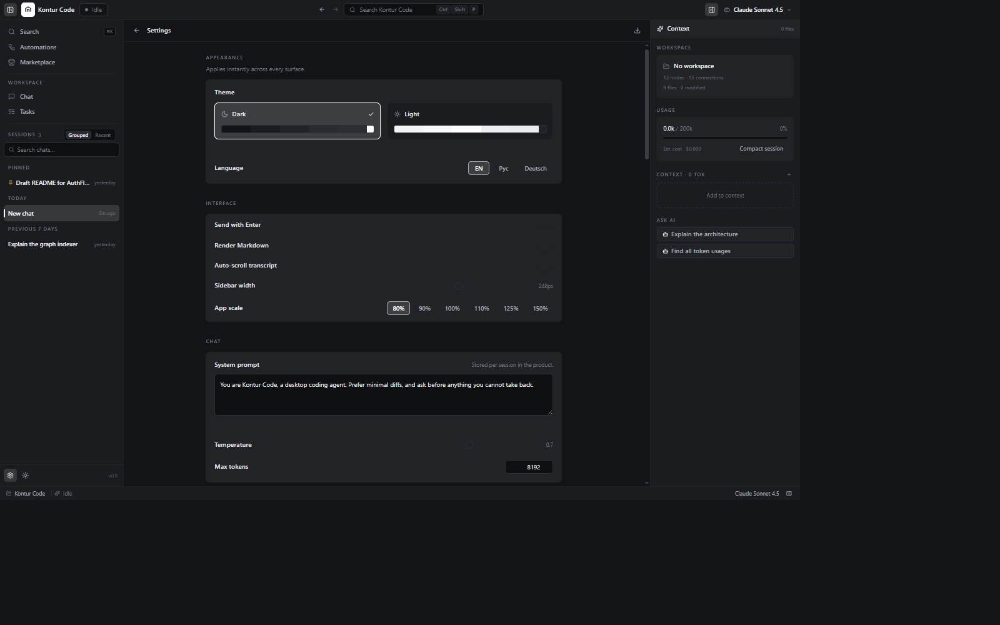

# Kontur Code

**最初に読んでください：** Kontur Codeは**あなたのファイルを書き換え、あなたのマシン上でプログラムを実行できる開発ツールです。** これは产品规格であって不具合ではありません。以下に記すエージェントの封じ込めと、既知の欠陥はすべて[SECURITY.md](SECURITY.md)にまとめてあります。大切なものにこのツールを向ける前に、先にそれを読んでください。

[English](README.md) · [Русский](README.ru.md) · [Deutsch](README.de.md) · [Español](README.es.md) ·
[Français](README.fr.md) · [Português (Brasil)](README.pt-BR.md) · [Italiano](README.it.md) ·
[中文（简体）](README.zh-CN.md) · [日本語](README.ja.md) · [한국어](README.ko.md) · [Türkçe](README.tr.md)

---

デスクトップ向けのLLMクライアントが、**空間的なAI開発環境**へと育った製品です。ウィンドウはひとつ、APIキーは自分のもの、会話はローカルのSQLiteファイルに書き出されます。そして、指定したフォルダを目で追えるグラフへ変えるワークスペースを備えています。

ウィンドウより下すべてのレイヤーを二つのホストが共有しています。同じ.NETコアの上に立つ**WPFアプリケーション**と、**Electron + React**のシェルです。どちらのツールキットの性能上限にも縛られません。

<p align="center">
  
</p>

---

## 目次

- [スクリーンショット](#スクリーンショット)
- [できること](#できること)
- [エージェント](#エージェント)
- [プライバシーの要点](#プライバシーの要点)
- [必要条件](#必要条件)
- [インストール](#インストール)
- [初回起動](#初回起動)
- [アーキテクチャ](#アーキテクチャ)
- [開発](#開発)
- [ドキュメント](#ドキュメント)
- [コントリビューション](#コントリビューション)
- [ライセンス](#ライセンス)
- [ステータス](#ステータス)

---

## スクリーンショット

### チャット

<p align="center">
  
</p>

トークンは届いたぶんだけ表示されます。回答の途中で止めても、**途中までのテキストは破棄されず保存されます**。次のターンのコンテキストとしてそのまま使えます。

### 空間キャンバス

<p align="center">
  
</p>

プロジェクトをグラフとして見たものです。ファイル、フォルダ、モジュール、サービス、インターフェース、データ、テスト、計画がそれぞれノードになり、その間に包含関係と依存関係の辺が張られます。パン、ズーム、マーキー選択ができ、隅にはグラフ全体のミニマップが映っています。辺にはラベルが付いています。`Login() → CreateTokenAsync`は呼び出しの辺であり、「コンパイル時のみ」は実行されない依存関係です。

### グラフのアウトライン

<p align="center">
  
</p>

同じグラフを、読んで名前やパスで絞り込める構造として見たものです。

### エディタ

<p align="center">
  
</p>

10種類の言語文法に対応したCodeMirror 6。選択範囲へのAIによるインライン編集と、ゴーストテキスト補完を備えています。

### 設定

<p align="center">
  
</p>

テーマ、インターフェース言語、アプリの表示倍率、システムプロンプト、サンプリングパラメータ。すべてローカルで、すべて自分のデータベースに保存されます。

---

## できること

- **ストリーミングチャット。** トークンは生成された順に届きます。途中で止めても応答は途中まで残ります。再生成するとその場で置き換え、必要なら別のモデルで生成し直すこともできます。
- **三つの作業モード。** 会話のための*Chat*、分析のための*Cowork*、そしてエージェントがワークスペースとツールループを手に 넣る*Code*。モードはアプリではなくメッセージの属性なので、「まず計画して、それから実装」は設定画面を二往復する代わりに二通のメッセージで済みます。
- **空間グラフ。** 指定したフォルダは自動的にノードと辺へインデックスされます。差分ベースのインデクサーが新しいファイルを足し、削除されたファイルを取り除き、**あなたが配置したレイアウトを保持します**。エージェントが作った計画は、ノードと辺の集合としてキャンバス上に現れます。取り消しもでき、保存され、必要なら 거부することもできます。
- **統合されたワークスペースの画面。** 地図としてのキャンバス、構造としてのグラフ、ファイルツリー、エディタ、gitパネル、実行ごとの軌跡、タスク一覧。すべて`Ctrl+Shift+P`ひとつで移り合えます。
- **Git。** ステータス、ステージ済みと未ステージの差分、ステージ、コミット、ブランチ、revert、push、pull、fetch。すべて`git`を経て、**シェルは使わず**、引数も検証しています。
- **トークン使用量。** 現在の使用量、推定コスト、そしてモデルが実際にコンテキストに保持しているもの。古いターンを要約に畳み込む**セッションを圧縮**というボタンがあります。
- **Markdownレンダリング。** 見出し、リスト、表、引用、タスクリスト、フェンスドコード。シンタックスハイライト付きで、構造化されたコンテンツとして描画され、**注入されたHTMLとして描画されることはありません**。
- **モデルカタログ。** 各プロバイダーから取得してSQLiteにキャッシュされるので、選択UIはそれ以降オフラインでも動きます。コンテキストウィンドウ、価格、機能はハードコードされた一覧ではなくプロバイダーから取得します。
- **標準で二のプロバイダー** — OpenRouterとNVIDIA NIM。どちらもOpenAI互換です。NVIDIAのエンドポイントをローカルのOllama、LM Studio、自前のNIMコンテナに向ければ、データは一切マシンの外に出ません。
- **セッションバンドル。** セッション全体を、チャット・キャンバス・ファイル・目標込みで`.zip`として書き出せます。
- **三言語対応。** 英語・ロシア語・ドイツ語を、画面全体をリアルタイムで切り替えます。
- **ライトとダーク。** システム設定に従うか、任意で固定するかを選べます。

---

## エージェント

エージェントはツールループを回します。そして、その手が届く範囲こそ、使う前に理解しておくべきポイントです。

| | |
| --- | --- |
| **動作する場所** | あなたが指定した一つのフォルダ。それより外側を読み書きすることを拒否します |
| **そのフォルダの内側でも拒否されるもの** | `.git`、`.env`、`credentials.json`、`*.pem`、`*.key`、`*.pfx` — 名前によって、常に拒否されます |
| **事前に尋ねてから行うもの** | すべての書き込み、外部ファイル、ネットワーク要求、プログラムの実行 |
| **決して行わないこと** | シェルの実行。`&&`、`\|`、`>`、`$HOME`はプログラムに渡されるただの文字列です |
| **プログラム** | 初期状態では無効です。有効にした後も、実行できるのは人間が編集する許可リストに記載されたプログラムだけで、しかも*呼び出しのたびに*承認が要ります |
| **元に戻す手段** | バージョン管理です。変更は（元に戻されるのではなく）行われる前に表示されます |

拒否時にはルールの名前が明示され、代わりに何をすべきかがモデルに伝えられます。そのため、同じツールを何度も頼むことはなくなります。

**そのフォルダの外側にあるものはすべてオプトインであり、オンにするまで無効です。** ネットワークの取得とプロジェクト外ファイルへのアクセスは、設定の中で別々のスイッチになっています。しかも、どちらの場合も各呼び出しは承認プロンプトを通ります。

> 封じ込めの全体像 — そして**既知の欠陥八件**。その中にはWindowsのジャンクションによって、プロジェクト外
> ファイルに対する認証情報ファイル名のルールを回避できてしまうものが含まれます — は
> [SECURITY.md](SECURITY.md)にあります。これはalpha版です。信頼する前に読んでください。

---

## プライバシーの要点

- **テレメトリなし。解析なし。クラッシュレポートなし。アカウントなし。** このリポジトリに、このプロジェクトが保有するアドレスへ接続するコードは一行もありません。
- **会話がサーバーに触れることはありません。** それはあなた自身のユーザープロファイルフォルダにあるSQLiteファイルです。
- **APIキーは暗号化されます。** Windows DPAPIで暗号化し、あなたのWindowsアカウントに紐づけられ、ログに書かれることはありません。
- **マシンの外へ出るもの：** モデルプロバイダーへ送るものだけで、しかも送信ボタンを押したときだけです。ネットワーク送信先の完全な一覧は[PRIVACY.md § 5](PRIVACY.md#5-what-leaves-your-machine-and-who-receives-it)にあります。
- **連続した会話ログは、このアプリなしで読み取れます。** データベースは保存時の暗号化されていません。意図的なトレードオフであり、覆い隠すのではなく文書化しています。
- **モデルプロバイダーはあなたのプロンプトを見ます。** 適用されるのはこのプロジェクトのポリシーではなく、*プロバイダー側*のポリシーです。他人のモデルを使うクライアントは、そういう契約で動いています。

GDPR、ロシアの152-FZ、CCPA/CPRAに沿って書かれた詳細のすべては[PRIVACY.md](PRIVACY.md)にあります。書き出し方と、全部消す方法も併せて説明しています。

---

## 必要条件

- Windows 10 バージョン1809以降、またはWindows 11
- [.NET 10 Desktop Runtime](https://dotnet.microsoft.com/download) — インストーラー専用です。公開ビルドにはランタイムが、ソースにはSDKが必要です
- [OpenRouter](https://openrouter.ai)または[NVIDIA](https://integrate.api.nvidia.com)のAPIキー
- ディスク500MBほどと、エージェントに読ませることに同意できるフォルダ

クロスプラットフォームのビルドはありません。DPAPIとWPFはWindows専用であり、そのことは実行時に失敗するのではなく、ターゲットフレームワークの時点で明示されています。

---

## インストール

インストーラーは[リリースページ](https://github.com/rwarx/kontur-code/releases)からダウンロードしてください。ユーザー単位のNSISインストールで、管理者権限は不要です。

最初のリリースは**alpha版**です。紙面の形が整い、基盤として構築するには十分になったので公開しています。无人運用に使える状態だからではありません。

<details>
<summary>自分でビルドする</summary>

```bash
git clone https://github.com/rwarx/kontur-code.git
cd kontur-code

# サイドカーはElectronが探しに行く場所に配置する必要があります
dotnet publish src/AIClient.Server -c Release -r win-x64 --self-contained false -o electron/sidecar

cd electron
npm install
npm run dist      # → electron/release/
```

.NETソリューションだけをビルドすると、WPFホストが得られます。

```bash
dotnet build AIClient.slnx
dotnet run --project src/AIClient.App
```

</details>

---

## 初回起動

1. **設定 → プロバイダー**でAPIキーを貼り付け、**更新**を押します。どれか一つのプロバイダーが成功するまでモデル選択UIは空のままです。カタログはキャッシュされるので、それ以降はオフラインでも動きます。
2. **フォルダを開きます。** *Code*モードならプロジェクトを指定します。そのフォルダがグラフにインデックスされ、以後エージェントの世界はそのフォルダになります。
3. **動かす前にコミットしてください。** 何もない`git commit`でも構いません。エージェントはステージ済みのものもバックアップもない状態で、あなたの作業ツリーへ直接書き込みます。元に戻す手段は履歴だけであり、それだけです。
4. コマンド実行やプロジェクト外ファイルへのアクセスを有効にするつもりなら、**[SECURITY.md](SECURITY.md)を読んでください。** どちらも初期状態では無効で、どちらも角の立った機能です。

---

## アーキテクチャ

五つのプロジェクト、ひとつの原則。**依存は内側を向く。** `Domain`と`Application`はプレーンな`net10.0`を対象としているため、WPFやDPAPIに触れようとすると、レビューコメントではなくコンパイルエラーになります。

```text
AIClient.Domain ◄──── AIClient.Application ◄──── AIClient.Infrastructure
                          ▲                          ▲            ▲
                          └──────── AIClient.App ────┘            │
                          └──────── AIClient.Server ─────────────┘
```

```text
provider bytes ──► AIStreamEvent ──► ChatTurnEvent ──► the UI
   (SSE frames)       (Domain)          (Application)    (WPF or React)
```

イベントボキャブラリーは三種類あり、どれも前のものより範囲が狭く、境界ごとに翻訳されます。プロバイダーが返す型にデータベースのidを入れることはできません。返す型とUIが消費する型は別のものだからです。

ローカルAPIは起動ごとにベアラートークンを要求し、ループバック以外へのバインドを拒否します。ループバック上にいることは認可の境界ではなく、コードもそれを境界として扱っていません。

ファイルシステムへの二つの入口と、二つのキャンバスレンダラーも含めて、完全な理屈は[ARCHITECTURE.md](ARCHITECTURE.md)にあります。

---

## 開発

```bash
dotnet build AIClient.slnx     # 警告はエラーとして扱います — これは意図的です
dotnet test                    # 896件のテスト、ネットワークもAPIキーも不要

cd electron
npm install
npm run typecheck
npm run dev                    # 種済みのデモワークスペースに対するレンダラー、バックエンドは不要
```

Windowsと.NET 10 SDKが必要です。Node 22はレンダラーにのみ必要です。

意味を持つもののうち`.editorconfig`では表せない規約は[CONTRIBUTING.md](CONTRIBUTING.md)にあります。

---

## ドキュメント

| 文書 | 内容 |
| --- | --- |
| [ARCHITECTURE.md](ARCHITECTURE.md) | コードがこの形になっている理由。構造を変える前に読んでください。 |
| [DEVELOPMENT.md](DEVELOPMENT.md) | ビルド、移行、テスト、拡張。何を変える前にでも読んでください。 |
| [SECURITY.md](SECURITY.md) | 脅威モデル、何が保護されているか、**そして既知の欠陥**。 |
| [PRIVACY.md](PRIVACY.md) | どんなデータが存在し、どこへ行き、あなたの権利は何か。GDPR / 152-ФЗ / CCPA。 |
| [CHANGELOG.md](CHANGELOG.md) | すべての変更。セキュリティ修正が明示されています。 |
| [THIRD-PARTY-NOTICES.md](THIRD-PARTY-NOTICES.md) | 同梱コンポーネントと、それぞれのライセンス。 |
| [CONTRIBUTING.md](CONTRIBUTING.md) · [CODE_OF_CONDUCT.md](CODE_OF_CONDUCT.md) · [SUPPORT.md](SUPPORT.md) | 参加する方法。 |

---

## コントリビューション

貢献を歓迎します。エージェントの安全モデルの変更に対してレビュー基準が高いのは、意図的なことです。そのコードはあなたのマシンでファイルを書き換え、プログラムを実行できるからです。

まず[CONTRIBUTING.md](CONTRIBUTING.md)を読んでください。要約すると、プルリクエスト一件につき論理的な変更ひとつ、`dotnet test`がグリーン、そしてエージェントの届く範囲に手を入れるなら、どのゲートの後ろに置いたかを説明文に書いてください。

セキュリティ上の脆弱性については、**公開のissueを立てないでください** — 非公開での報告方法は[SECURITY.md](SECURITY.md)にあります。

---

## ライセンス

**MIT。** [LICENSE](LICENSE)を参照してください。

サードパーティのコンポーネントはそれぞれのライセンスを保ちます — 同梱パッケージおよそ40個に加えてElectronとChromium — が、全部[THIRD-PARTY-NOTICES.md](THIRD-PARTY-NOTICES.md)に記録されています。

---

## ステータス

`0.1.0-alpha`。意図的にプレリリースとして公開しています。

**動いているもの：** ストリーミングチャット、両方のホスト、空間グラフとキャンバス、承認ゲートをもったエージェントのツールループ、エディタ、git、セッションとバンドル、三言語。

**うまく動かないことが分かっているもの** — [CHANGELOG](CHANGELOG.md#known-limitations)にすべて列挙し、[SECURITY.md](SECURITY.md#known-gaps)にはファイル参照付きで列挙してあります:

1. Windowsのジャンクションによって、プロジェクト外ファイルアクセスに対する認証情報ファイル名のルールを回避できてしまうことがあります。
2. 二つの承認が同時に届くと、実行を失敗させるのではなくハングさせることがあります。
3. イベントストリームにはハートビートも再接続もありません。接続が切れると実行は失われます。
4. エディタはデバウンスがなく、打鍵ごとにディスクへ書き込みます。
5. レンダラーはワークスペースのファイル内容を`localStorage`へ永続化します。大規模なプロジェクトではブラウザの容量制限を超えることがあります。
6. 最新の機能面 — 外部ファイルツール、フェッチャー、サーバー、git操作 — にはテストがありません。このリリースで行った修正には*テストがあります*。

これは、背後に資金のない小さなプロジェクトによる`0.x`版です。公開の場で開発されており、issueには最善を尽くして答えますが、SLAはありません。必要であれば、それはベンダーとの話であって、このリポジトリとの話ではありません。

---

<p align="center"><sub>MITライセンス。公開の場で開発。スクリーンショットは起動中のアプリケーションから取得。</sub></p>
